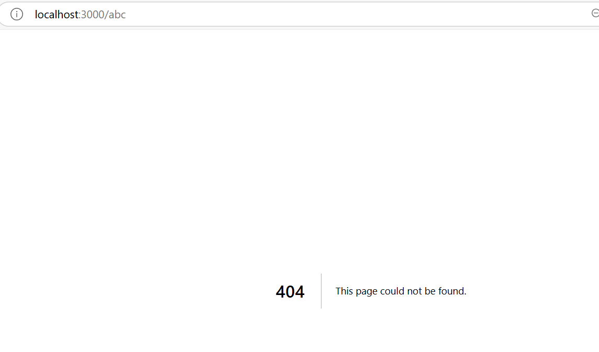

# NextJs_Handson

What is Next Js

 - react based framework for building full stack web applications
 - react is library for UI layer
 - additional features to build production ready
 - routing, optimized rendering, data fetching, bundling and compling

 1. routing - file based routing
 2. API routes - both fronend react components and backend APIs in one application - seamless integration
 3. rendering - Server side and client side ( improved performance and SEO )
 4. data fetching - built-in async support
 5. styling
 6. optimization - for images, fonts, scripts...
 7. dev and prod build system

 Pre-req:
 1. html
 2. css
 3. modern JS
 4. react fundamentals - function components, props, state, jsx, hooks

setup:

1. IDE - vscode
2. Node js

Hello world in Next JS

`npx create-next-app@latest`

`npm run dev`

# folder structure

1. package.json - all project dependencies and scripts startup definition
2. next.config.ts, tsconfig.json, eslint.config.mjs, tailwind.config.ts, postcss.config.mjs - config files
3. .gitignore - for version control
4. next-env.d.ts - typescript declation for next js
5. .next folder - when npm run / build - next app is served from
6. node modules folder - home for all installed dependencies
7. public - static assets / svgs
8. SRC - we will have app folder
     - favicon
     - global.css
     - laybout.css - shared UI elements
     - page.tsx - home at localhost:3000

when `npm run dev`
 - execution starts at package.json -> then layout.tsx -> root layout is rendered -> page.tsx ( home component )

React server components  ( to understand routing )

 - a new architecture by react and quickly adopted in next js
 - server component
    -  By default, Next Js creates all components as `server` components
    -  like reading files / fetching data directly from database
    - catch is - they cannot handle react hooks / handle user interactions

- client componenet
    - need to add "use client" directive at the top of the component file
    - cannot do - reading files / fetching data
    - can do hooks & user interaction as running at browser
    - traditional react components

# Routing

 - file system based routing system
 - URLs you can access are determined by how you organize ur files and folders in your code
 - every file in app router is a route ( src/app)
 - routing conventions
  - all routes must live inside app folder
  - named page.js or page.tsx
  - each folder represents a segment of the URL path

for sample

1. homepage at localhost:300

 
layout file ( will be automatically created when first access the root route)

2. file based routing
 - /about - src/app/about/page.tsx with about function
 - /profile - src/app/profile/page.tsx with profile function

what if we visit /abc when it is not present
 - next js handles non existing routes

Nested Routes

 - localhost:3000/blog - src/app/blog/page.tsx
 - localhost:3000/blog/first - src/app/blog/first/page.tsx
 - localhost:3000/blog/second - src/app/blog/second/page.tsx

scenario 4- Dynamic routes `[]`

when user visits

/products - product1, product2 ,product3

/products/id
    - products/1 - > product 1 details

to show which product ?
every page in the app routes - receives route parameter through params probe

scenario 5 -nested dynamic routes

 - localhost:3000/products/1
 - localhost:3000/products/1/reviews/1

 